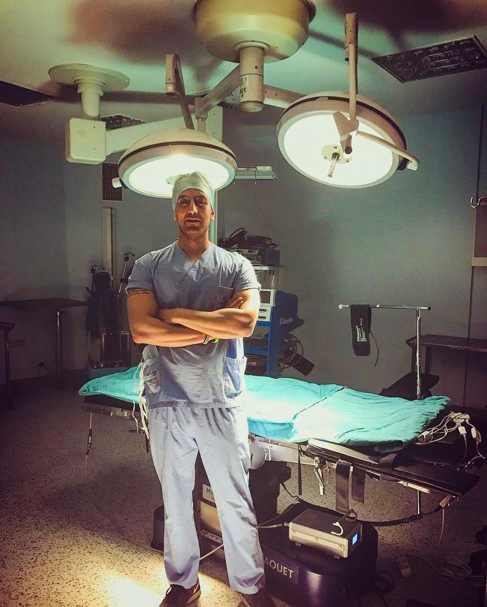

## Fun Fact
## A Twin Brother!
I have a twin brother who is not in academia but has more [publications](https://pubmed.ncbi.nlm.nih.gov/?term=Alpergin+baran) than me. He is a brain surgeon in Turkey. Here is a picture of him that also doesn't look like me.

## Travelled to 17 Countries!

I can not wait to travel to more. Maybe I should do a city version of this list!
  1. Turkey
  2. USA
  3. Sweden
  4. Norway
  5. Spain
  6. United Kingdom
  7. Italy
  8. France
  9. Greece
  10. Czechia
  11. Hungary
  12. Austria
  13. Germany
  14. Serbia
  15. Tunisia
  16. Cyprus
  17. Bahamas

## Books and Movies 

Here are a few books and movies that I like.

  1. Jitterbug Perfume - Tom Robbins
  2. Survivor - Chuck Palahniuk
  3. The Unbearable Lightness of Being - Milan Kundera
  4. Mommy - directed by Xavier Dolan
  5. Relatos salvajes - directed by Damián Szifron

